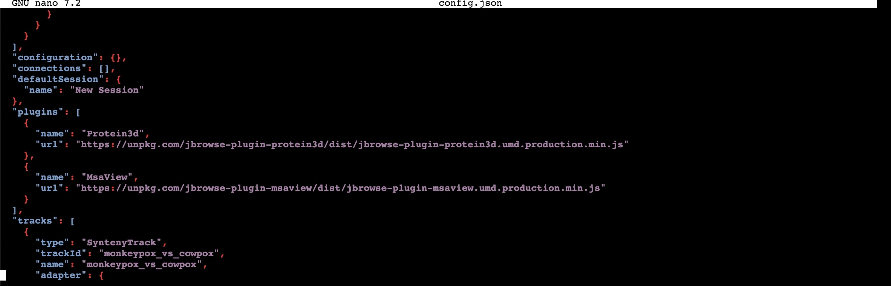

# Final Project Documentation
The documentation will walk you through setting up the JBrowse2 Genome Browser and uploading the genome data for five specific virus in the poxvirus family (variola, vaccinia, cowpox, Mpox, and fowlpox). After following the instructions, you will be able to interact with the linear synteny view, 3D protein visualization, multiple sequence alignment view, and the pylogenetic tree features.

## 1. Pre-setting for the Jbrowse
Please follow the link to setup the jbrowse with the preferred platform. (https://github.com/bioe131/lab-8-KarinaJin) or the documentation from jbrowse website.(https://jbrowse.org/jb2/docs/quickstart_web/)

Before the next step, make sure that you can see the following:

In your browser, type in http://yourhost/jbrowse2/, where yourhost is either localhost or the IP address from earlier. 
Now you should see the words "It worked!" with a green box underneath saying "JBrowse 2 is installed." with some additional details.

## 2. Load and process viral data

### 2.1. Download and process reference genome
Make sure you are in the temporary folder you created from the above instruction, then download the viral genomes in fasta format using wget.

Here is the genome sequence link used to download from NCBI:
1. Vaccinia:
https://ftp.ncbi.nlm.nih.gov/genomes/all/GCF/000/860/085/GCF_000860085.1_ViralProj15241/GCF_000860085.1_ViralProj15241_genomic.fna.gz
2. Monkeypox: https://ftp.ncbi.nlm.nih.gov/genomes/all/GCA/006/465/845/GCA_006465845.1_ASM646584v1/GCA_006465845.1_ASM646584v1_genomic.fna.gz
3. Cowpox:    https://ftp.ncbi.nlm.nih.gov/genomes/all/GCF/000/839/185/GCF_000839185.1_ViralProj14174/GCF_000839185.1_ViralProj14174_genomic.fna.gz
4. Variola:   https://ftp.ncbi.nlm.nih.gov/genomes/all/GCF/000/859/885/GCF_000859885.1_ViralProj15197/GCF_000859885.1_ViralProj15197_genomic.fna.gz
5. Fowlpox:   https://ftp.ncbi.nlm.nih.gov/genomes/all/GCF/000/838/605/GCF_000838605.1_ViralProj14052/GCF_000838605.1_ViralProj14052_genomic.fna.gz

Use the following command line to get the data into your tmp folder, making sure to add one virus at a time before adding the second.
Let's use vaccinia as the example:

```
wget https://ftp.ncbi.nlm.nih.gov/genomes/all/GCF/000/860/085/GCF_000860085.1_ViralProj15241/GCF_000860085.1_ViralProj15241_genomic.fna.gz
```

Unzip the gzipped reference genome, rename it, and index it. This will allow jbrowse to rapidly access any part of the reference just by coordinates.

```
gunzip GCF_000860085.1_ViralProj15241_genomic.fna.gz
mv GCF_000860085.1_ViralProj15241_genomic.fna.gz vaccinia.fa
samtools faidx vaccinia.fa
```

Then we upload it to the jbrowse2.
-n means to specify which assembly this file belongs to.

```
jbrowse add-assembly vaccinia.fa --out /var/www/html/jbrowse2 --load copy -n vaccinia
```
Repeat these steps with the other four viruses, using the appropriate names when uploading the genomes.


### 2.2. Download and process genome annotations

Still in the temporary folder, download genome annotations in the GFF format. 

Here is the genome annotations files' link that we will be download from NCBI:
1. Vaccinia:  https://ftp.ncbi.nlm.nih.gov/genomes/all/GCF/000/860/085/GCF_000860085.1_ViralProj15241/GCF_000860085.1_ViralProj15241_genomic.gff.gz
2. Monkeypox: https://ftp.ncbi.nlm.nih.gov/genomes/all/GCA/006/465/845/GCA_006465845.1_ASM646584v1/GCA_006465845.1_ASM646584v1_genomic.gff.gz
3. Cowpox:    https://ftp.ncbi.nlm.nih.gov/genomes/all/GCF/000/839/185/GCF_000839185.1_ViralProj14174/GCF_000839185.1_ViralProj14174_genomic.gff.gz
4. Variola:   https://ftp.ncbi.nlm.nih.gov/genomes/all/GCF/000/859/885/GCF_000859885.1_ViralProj15197/GCF_000859885.1_ViralProj15197_genomic.gff.gz
5. Fowlpox:   https://ftp.ncbi.nlm.nih.gov/genomes/all/GCF/000/838/605/GCF_000838605.1_ViralProj14052/GCF_000838605.1_ViralProj14052_genomic.gff.gz

Use the following command line to get the data into your tmp folder, making sure to add one virus at a time before adding the second.
Let's use vaccinia as the example:

```
wget https://ftp.ncbi.nlm.nih.gov/genomes/all/GCF/000/860/085/GCF_000860085.1_ViralProj15241/GCF_000860085.1_ViralProj15241_genomic.gff.gz
gunzip GCF_000860085.1_ViralProj15241_genomic.gff.gz
```

```
jbrowse sort-gff GCF_000860085.1_ViralProj15241_genomic.gff.gz > vaccinia_ann.gff
bgzip vaccinia_ann.gff
tabix vaccinia_ann.gff.gz
```

Then we load the annotation track into jbrowse using the following command line:
```
jbrowse add-track genes.gff.gz --out $APACHE_ROOT/jbrowse2 --load copy
```
Repeat these steps with the other four viruses, using the appropriate names when uploading the tracks.


## 3.0 Embedded the Plugin for the feature
Using terminal, go to the jbrowse2 folder with the path: /var/www/html/jbrowse2
Open the file called "config.json" using the text editor. In this documentation, nano will be used.
In the path: /var/www/html/jbrowse2
```
nano config.json
```
After this command line opens a text editor, add the following to the file after the default session json object:

```
"plugins": [
    {
      "name": "Protein3d",
      "url": "https://unpkg.com/jbrowse-plugin-protein3d/dist/jbrowse-plugin-protein3d.umd.production.min.js"
    },
{
      "name": "MsaView",
      "url": "https://unpkg.com/jbrowse-plugin-msaview/dist/jbrowse-plugin-msaview.umd.production.min.js"
    }
  ]
```
This will look like the following: 

Doing this will embed the plugins into JBrowse from the start.

## 4.0 Download minimap2 to generate the .paf file for linear synteny view feature
Make sure that minimap2is installed. If not, please use this link to install it: (https://github.com/lh3/minimap2?tab=readme-ov-file#install)
After minimap2 is installed, it will be used to generate the .paf files for the synteny tracks.

For example, I want to create a .paf file that shows the synteny between monkeypox and the other viruses.
Since we already have the viral FASTA files in our tmp directory, use the command below:

```
minimap2 monkeypox.fna cowpox.fna variola.fna fowlpox.fna vaccinia.fna > other_vs_monkeypox.paf
```
After the .paf file is created, it needs to be added as a track to JBrowse. 

**Important** The order of the assembly names really matters! With the command above, a .paf file is created that maps the commonalities between cowpox and monkeypox, variola and monkeypox etc. So when adding the track, the monkeypox assembly name is last and the order for the other assemblies should follow the order used when creating the .paf file.

```
jbrowse add-track other_vs_Mpox.paf --assemblyNames cowpox,variola,fowlpox,vaccinia,monkeypox --load copy --out /var/www/html/jbrowse2
```

## 5.0 Use MAFFT to create multiple sequence aligment
Install MAFFT using the following link: https://mafft.cbrc.jp/alignment/software/
Create a FASTA file that contains all the viral sequences.

On the command line type the following command:
```
mafft
```
and follow the instructions given from there.
Name the output FASTA file as alignment.fa and with input order
The file will be created after about 30 minutes - 1 hour using FFT-NS-1 (fast) strategy.

## 6.0 Use biopython muscle FastTree to generate the tree file
Install FastTree using the following link: http://www.microbesonline.org/fasttree/#Install
Use the following command to generate the tree.
```
!fasttree -nt < alignment.fa > poxvirusTree.nwk
```

Upload the alignment.fa file and the poxvirusTree.nwk file onto JBrowse by going to 'Add' in the top left corner and selecting 'Multiple sequence alignment view' nad uploading the files in their respective areas.

## 7.0 Interact with jbrowse
Now, you can use JBrowse to see explore the linear synteny, genome sequence, genome annotation, 3D protein visualization, and pylogenetic trees of the five poxviruses.

### 7.1 linear synteny view
